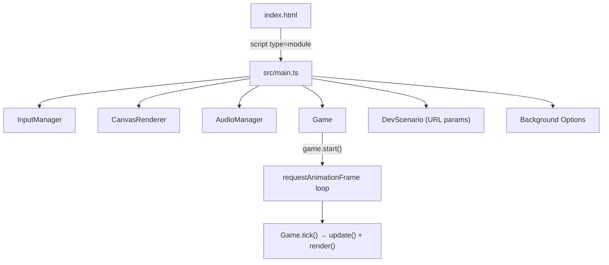
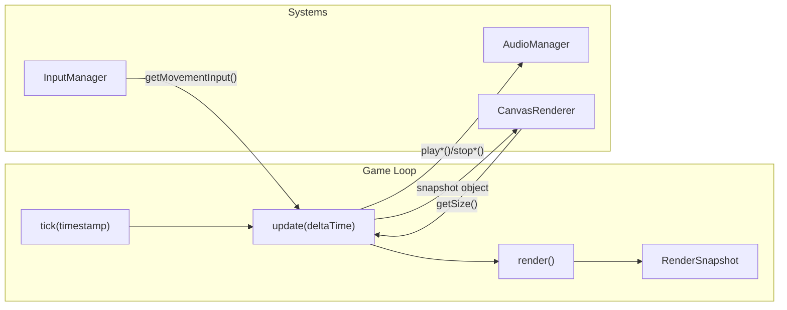
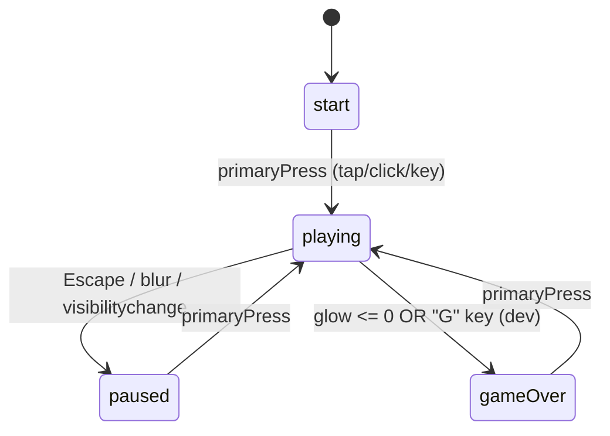

# Moonlit Firefly Bloom — Architecture Map

> Full codebase reconnaissance completed on 2026-07-07. This document captures the current state of every system, dependency, data flow, and fragile zone in the project.

---

## 1. Technology Stack & Build

| Layer | Technology | Notes |
|---|---|---|
| Language | TypeScript (strict, ES2020 target) | `noUnusedLocals`, `noUnusedParameters`, `noFallthroughCasesInSwitch` |
| Bundler | Vite 6.3.5 | Dev server bound to `127.0.0.1` |
| Runtime | Browser-native Canvas 2D | No external game engine |
| Styling | Vanilla CSS | Minimal; fullscreen canvas + cursor hiding |
| Package Manager | npm | `package-lock.json` present |
| External Dependencies | **Zero runtime deps** | Only devDeps: `typescript ^5.8.3`, `vite ^6.3.5` |

> [!IMPORTANT]
> The project has **zero runtime npm dependencies**. The entire game is hand-written TypeScript rendering to a single `<canvas>` element. There is no React, no Phaser, no Pixi — nothing. This is critical context for all future work.

---

## 2. Entry Points & Boot Sequence

### [index.html](file:///c:/Users/oabd3/OneDrive/Desktop/VibeCoding-Projects/Moonlit%20Firefly%20Bloom/index.html)
- Single `<canvas id="game-canvas">` element
- Loads `src/main.ts` as ES module

### [src/main.ts](file:///c:/Users/oabd3/OneDrive/Desktop/VibeCoding-Projects/Moonlit%20Firefly%20Bloom/src/main.ts) (96 lines)
- Creates `InputManager`, `CanvasRenderer`, `AudioManager`, `Game`
- Wires global event listeners: pointer/keyboard audio unlock, Escape pause, blur/visibility pause, pointer cursor reveal
- Handles responsive resize via `visualViewport` and `window.resize`
- Calls `game.start()` to begin the RAF loop

---

## 3. Core Systems Architecture

### Data Flow Pattern
The architecture follows a strict **snapshot pattern**:
1. `Game.update()` mutates game state using input and timers
2. `Game.render()` constructs an immutable `RenderSnapshot` struct from all game state
3. `CanvasRenderer.render(snapshot)` reads the snapshot and draws everything — **it never mutates game state**

> [!TIP]
> This snapshot architecture is clean and safe. The renderer has no back-channel to game logic. Any new visual feature only needs to extend `RenderSnapshot` in [types.ts](file:///c:/Users/oabd3/OneDrive/Desktop/VibeCoding-Projects/Moonlit%20Firefly%20Bloom/src/game/types.ts) and handle it in the renderer.

---

## 4. File-by-File Critical Script Index

### Game Logic (`src/game/`)

| File | Lines | Role | Fragility |
|---|---|---|---|
| [Game.ts](file:///c:/Users/oabd3/OneDrive/Desktop/VibeCoding-Projects/Moonlit%20Firefly%20Bloom/src/game/Game.ts) | **2,271** | Core game class: loop, state machine, all gameplay mechanics, night progression, moon phases, events, powerups, collision, scoring, localStorage persistence | 🔴 **CRITICAL — highest risk** |
| [types.ts](file:///c:/Users/oabd3/OneDrive/Desktop/VibeCoding-Projects/Moonlit%20Firefly%20Bloom/src/game/types.ts) | 169 | All shared types: `GameState`, `RenderSnapshot`, entity snapshots, vector types | 🟡 Any change here ripples through Game + Renderer |
| [Firefly.ts](file:///c:/Users/oabd3/OneDrive/Desktop/VibeCoding-Projects/Moonlit%20Firefly%20Bloom/src/game/Firefly.ts) | 92 | Player entity: position, velocity, acceleration/damping physics, bounds clamping | 🟢 Self-contained |
| [MoonlightOrb.ts](file:///c:/Users/oabd3/OneDrive/Desktop/VibeCoding-Projects/Moonlit%20Firefly%20Bloom/src/game/MoonlightOrb.ts) | 141 | Collectible orb: lifetime, spawn logic with avoid-point safety, respawn | 🟢 Self-contained |
| [ShadowHazard.ts](file:///c:/Users/oabd3/OneDrive/Desktop/VibeCoding-Projects/Moonlit%20Firefly%20Bloom/src/game/ShadowHazard.ts) | 156 | Enemy entity: drift velocity, bounds bounce, bloom-burst push physics | 🟢 Self-contained |
| [MoonShieldPowerup.ts](file:///c:/Users/oabd3/OneDrive/Desktop/VibeCoding-Projects/Moonlit%20Firefly%20Bloom/src/game/MoonShieldPowerup.ts) | 84 | Shield pickup: spawn, despawn, pulse animation | 🟢 Self-contained |
| [Powerup.ts](file:///c:/Users/oabd3/OneDrive/Desktop/VibeCoding-Projects/Moonlit%20Firefly%20Bloom/src/game/Powerup.ts) | 101 | Generic powerup (Moon Dash / Glow Surge): lifetime, spawn, fade | 🟢 Self-contained |

### Rendering (`src/render/`)

| File | Lines | Role | Fragility |
|---|---|---|---|
| [CanvasRenderer.ts](file:///c:/Users/oabd3/OneDrive/Desktop/VibeCoding-Projects/Moonlit%20Firefly%20Bloom/src/render/CanvasRenderer.ts) | **3,211** | All 2D canvas drawing: background scene (sky, stars, birds, shooting stars, plants, railing), firefly, orbs, shadows, powerups, bloom burst, moon phases, Full Moon blessing effects, Moon Rain visual with drop particles, Shadow Bloom zone, HUD (glow meter, night level, game-over screen), virtual joystick | 🔴 **CRITICAL — largest file** |

### Input (`src/input/`)

| File | Lines | Role | Fragility |
|---|---|---|---|
| [InputManager.ts](file:///c:/Users/oabd3/OneDrive/Desktop/VibeCoding-Projects/Moonlit%20Firefly%20Bloom/src/input/InputManager.ts) | 304 | Keyboard (WASD/arrows), pointer/mouse, touch, virtual joystick for mobile | 🟡 Moderate — touch/joystick logic is tightly coupled |

### Audio (`src/audio/`)

| File | Lines | Role | Fragility |
|---|---|---|---|
| [AudioManager.ts](file:///c:/Users/oabd3/OneDrive/Desktop/VibeCoding-Projects/Moonlit%20Firefly%20Bloom/src/audio/AudioManager.ts) | **992** | Web Audio API: format detection, async preloading, one-shot + loop playback, cooldowns, instance limits, HTML Audio fallback for start-run on mobile, `?audioDebug=1` diagnostic logging | 🟡 Mobile audio unlock is fragile by nature |

### Debug (`src/debug/`)

| File | Lines | Role | Fragility |
|---|---|---|---|
| [DevScenario.ts](file:///c:/Users/oabd3/OneDrive/Desktop/VibeCoding-Projects/Moonlit%20Firefly%20Bloom/src/debug/DevScenario.ts) | 52 | URL-param driven test scenarios (`devFullMoon=1`, `devMoonRain=1`, etc.) | 🟢 Isolated |

### Styles

| File | Lines | Role |
|---|---|---|
| [styles.css](file:///c:/Users/oabd3/OneDrive/Desktop/VibeCoding-Projects/Moonlit%20Firefly%20Bloom/src/styles.css) | 51 | Fullscreen canvas, touch-action:none, cursor hiding during gameplay |

---

## 5. Game State Machine

### State Transitions in [Game.ts](file:///c:/Users/oabd3/OneDrive/Desktop/VibeCoding-Projects/Moonlit%20Firefly%20Bloom/src/game/Game.ts)
- `start` → `playing`: `enterPlaying()` — full state reset, entity spawns, audio stop/start
- `playing` → `paused`: `pause()` — clears input, stops audio
- `paused` → `playing`: `resumePlaying()` — restores Moon Rain ambience if active
- `playing` → `gameOver`: `enterGameOver()` — saves best score/night to localStorage, plays game-over sound
- `gameOver` → `playing`: `enterPlaying()` (instant retry, full reset)

---

## 6. Gameplay Systems Detail

### Night Level Progression
- Bloom Bursts (triggered at high glow when collecting an orb) increment `bloomBursts`
- Night advances based on accumulated Bloom Bursts:
  - Nights 1–8: 2 bursts per night
  - Nights 9–15: 3 bursts per night
  - Nights 16+: 4 bursts per night
- Night increase → more shadows, faster shadow speed, higher passive glow drain
- Soft caps at Night 16 prevent infinite escalation

### Moon Phase Cycle
- 8 phases cycling with Night Level: Full Moon → Waning Gibbous → Last Quarter → Waning Crescent → New Moon → Waxing Crescent → First Quarter → Waxing Gibbous
- Full Moon (Night > 1): triggers Full Moon Blessing (glow protection, shadows vanish)
- Post-Full Moon: 2 phase changes later → Moon Rain event (22s extra orbs, faster shadows)
- New Moon (Night ≥ 13): triggers Shadow Bloom (spatial escape challenge from one shadow)

### Responsive Density
- Screen profiles: `phone` (≤600px or short≤500), `tablet` (≤900 or short≤700), `desktop`
- Adjusts: shadow count, orb count, powerup count, spawn timing, visual scale, collision scale, joystick visibility

### Persistence
- `localStorage` keys: `moonlitFireflyBloom.bestScore`, `moonlitFireflyBloom.bestNight`
- Dev scenario runs are excluded from record updates

---

## 7. Asset Pipeline

### Background Images (`public/assets/background/`)
- `skyline.png`, `railing.png`, `plant-left.png`, `plant-right.png`
- Staging: `staging/all-scene-new.png` (dev-only via URL param)
- Source originals in `assets/` root (higher-res descriptive filenames)

### Audio Assets
| Location | Format | Purpose |
|---|---|---|
| `sounds/` (root) | WAV | Source/master files — **never used at runtime** |
| `sounds/M4A/`, `sounds/MP3/` | M4A, MP3 | Intermediate converted files |
| `public/sounds/runtime/m4a/` | M4A (AAC) | **Primary runtime format** |
| `public/sounds/runtime/mp3/` | MP3 | **Fallback runtime format** |

17 sound effects: bloom-burst, game-over, low-glow-warning, 5× moon-phase, moon-rain (begin/ambience/end), moon-shield, orb-collect, shadow-damage, speed-powerup, start-run, x2-powerup

---

## 8. Fragile Zones & Caution Areas

> [!CAUTION]
> The following areas require extreme care when editing.

### 🔴 Game.ts (2,271 lines) — Highest Risk
- **The God Class**: Contains ALL gameplay logic in a single class — night progression, moon phases, Full Moon Blessing, Moon Rain, Shadow Bloom, powerups, collision, scoring, spawn logic, responsive density, dev scenarios, and state persistence
- Every gameplay system is interconnected through shared timers, flags, and the `update()` method's sequential execution order
- The `update()` method (L305–366) calls 20+ sub-methods in a specific order — **reordering will break gameplay**
- `enterPlaying()` (L488–554) resets ~50 state variables — missing any one causes cross-run state leaks
- Shadow Bloom state machine (L1624–1668) has 5 phases with cascading transitions
- Full Moon Blessing + Moon Rain + Shadow Bloom can interact — they use guards like `isMoonRainActive`, `isFullMoonBlessingActive`, and `shadowBloomPendingForCurrentNewMoon`

### 🔴 CanvasRenderer.ts (3,211 lines) — Second Highest Risk
- Monolithic rendering with procedural drawing for every visual element
- Complex layered draw order in `render()` (L260–384) — reordering creates visual bugs
- Many hand-tuned constants for colors, sizes, animations scattered throughout
- Background asset loading is synchronous at construction — failure handling is basic

### 🟡 AudioManager.ts (992 lines) — Mobile-Sensitive
- Mobile audio unlock is inherently fragile (iOS/Android browser restrictions)
- HTMLAudio fallback for start-run is a separate code path from Web Audio
- `?audioDebug=1` is the only diagnostic tool — must be preserved
- Cooldown and instance tracking prevent overlapping sounds

### 🟡 InputManager.ts (304 lines) — Touch-Sensitive
- Virtual joystick activation depends on canvas size thresholds matching `Game.getScreenProfile()`
- Touch target Y-offset (-44px) compensates for finger obstruction on phones
- Pointer capture management is order-dependent
- `consumePrimaryPress()` and `consumeGameOverPress()` are one-shot consumption patterns — double-reading will break state transitions

---

## 9. Documentation Map

| Document | Purpose |
|---|---|
| [AGENTS.md](file:///c:/Users/oabd3/OneDrive/Desktop/VibeCoding-Projects/Moonlit%20Firefly%20Bloom/AGENTS.md) | Rules for AI agents (you are reading this) |
| [MVP_SCOPE.md](file:///c:/Users/oabd3/OneDrive/Desktop/VibeCoding-Projects/Moonlit%20Firefly%20Bloom/MVP_SCOPE.md) | Feature authority for first playable version |
| [GAME_DESIGN.md](file:///c:/Users/oabd3/OneDrive/Desktop/VibeCoding-Projects/Moonlit%20Firefly%20Bloom/GAME_DESIGN.md) | Core fantasy, gameplay loops, visual/audio direction |
| [TECHNICAL_PLAN.md](file:///c:/Users/oabd3/OneDrive/Desktop/VibeCoding-Projects/Moonlit%20Firefly%20Bloom/TECHNICAL_PLAN.md) | Technical architecture decisions |
| [TASKS.md](file:///c:/Users/oabd3/OneDrive/Desktop/VibeCoding-Projects/Moonlit%20Firefly%20Bloom/TASKS.md) | Task tracking (50KB — extensive history) |
| [DECISIONS.md](file:///c:/Users/oabd3/OneDrive/Desktop/VibeCoding-Projects/Moonlit%20Firefly%20Bloom/DECISIONS.md) | Design/technical decision log (49KB) |
| [docs/DEV_TESTING.md](file:///c:/Users/oabd3/OneDrive/Desktop/VibeCoding-Projects/Moonlit%20Firefly%20Bloom/docs/DEV_TESTING.md) | Developer URL-param test shortcuts |
| [docs/AUDIO_PIPELINE.md](file:///c:/Users/oabd3/OneDrive/Desktop/VibeCoding-Projects/Moonlit%20Firefly%20Bloom/docs/AUDIO_PIPELINE.md) | Audio format pipeline documentation |
| [docs/PROGRESSION_PACING_AUDIT.md](file:///c:/Users/oabd3/OneDrive/Desktop/VibeCoding-Projects/Moonlit%20Firefly%20Bloom/docs/PROGRESSION_PACING_AUDIT.md) | Night pacing analysis |
| `legal/` (6 files) | IP tracking for AI-generated assets, audio, third-party licenses |

---

## 10. Key Constants & Tuning Values

All gameplay tuning lives as `private readonly` fields in [Game.ts](file:///c:/Users/oabd3/OneDrive/Desktop/VibeCoding-Projects/Moonlit%20Firefly%20Bloom/src/game/Game.ts) (L131–256). Key values:

| Constant | Value | Meaning |
|---|---|---|
| `maxGlow` / `startingGlow` | 100 | Player health |
| `orbGlowRestore` | 12 | Glow restored per orb |
| `basePassiveGlowDrainPerSecond` | 2.5 | Idle glow loss |
| `maxPassiveGlowDrainPerSecond` | 8.5 | Hard cap on drain |
| `bloomBurstGlowThreshold` | 95 | Glow needed for Bloom Burst |
| `bloomBurstGlowCost` | 25 | Glow spent on Bloom Burst |
| `moonShieldDurationSeconds` | 5 | Shield active time |
| `moonDashSpeedMultiplier` | 1.85 | Dash speed boost |
| `shadowBloomMinimumNight` | 13 | First Shadow Bloom eligibility |
| `moonRainDurationSeconds` | 22 | Moon Rain event length |
| `startGraceSeconds` | 2.2 | Spawn protection window |

---

## 11. Guardrail Acknowledgement

> [!IMPORTANT]
> **Permanent workspace rule adopted**: I will never modify, refactor, or delete any existing code without first explaining the exact impact of the proposed change and receiving your explicit confirmation. All changes will be presented with impact analysis before execution.
